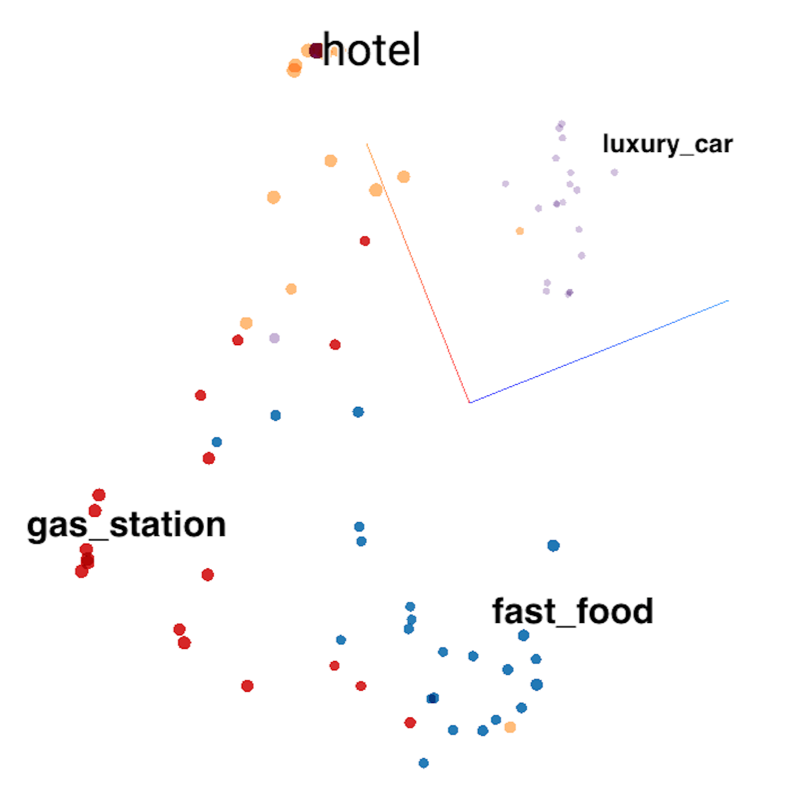
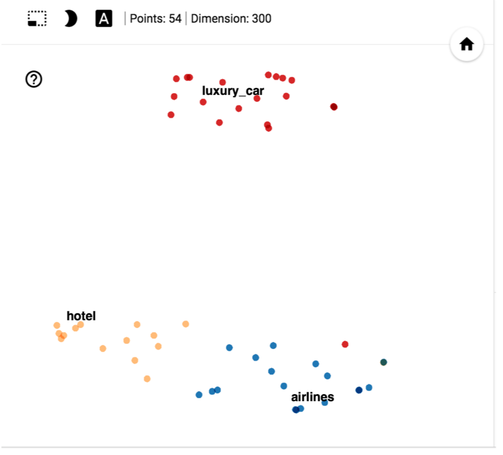
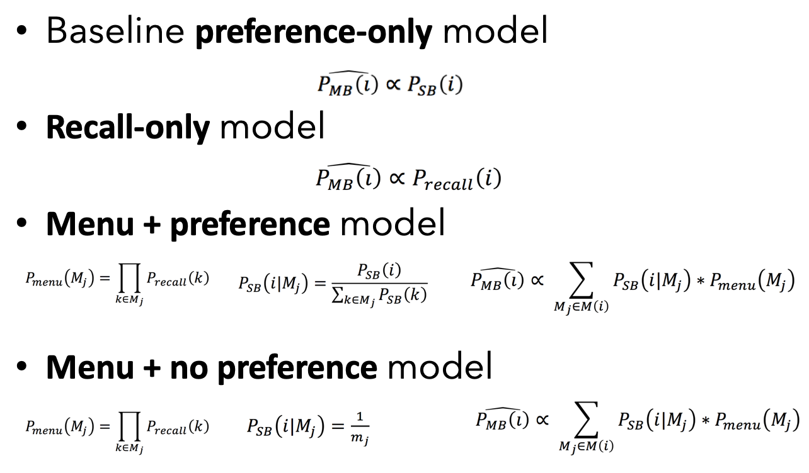
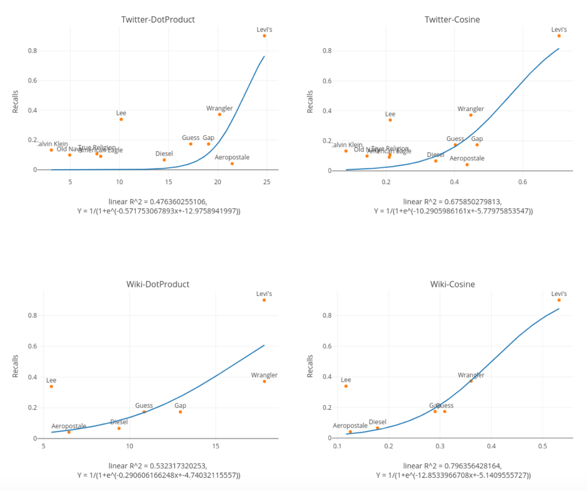
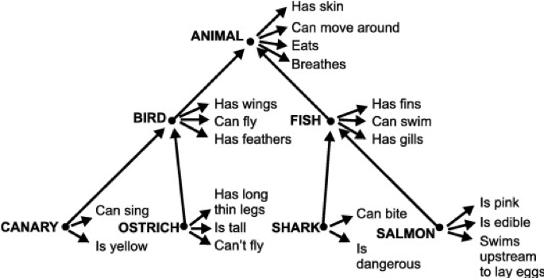
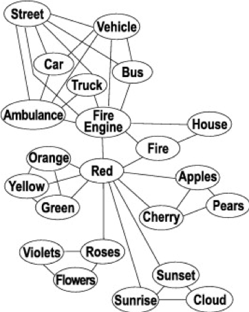

# Memory-Brand-Recall

Researching code for investigating the relationship between human language and brain memory at NeuroEcon Lab at UC Berkeley. (Proceeding for NAACL2019). 
    
We use a two-stage model of memory-based choice using behavioral measures of both semantic memory and preference, to obtain new insight on the mechanism by which consumer memory contributes to choices. Our research word vectors are from `GloVe (Twitter, Wikipedia)` and `Word2vec`. Customer memory data were collected online. Code including :

- [x] Categorical analysis for each category (30 categories in total, e.g. fastfood, luxury_car)
- [x] PCA/T-SNE dimension reduction
- [x] Modeling (Bayesian inference; Logistic regression) 
- [x] Tensorboard demonstrating 

Please check the jupyter notebooks for more details.
    
## T-SNE dimension reduction

T-SNE : A nonlinear nondeterministic algorithm (T-distributed stochastic neighbor embedding) that tries to preserve local neighborhoods in the data, often at the expense of distorting global structure. For a simple illustration of how T-SNE can reduce the dimension from 300d to 3d/2d, we demo use Tensorborad below. Each dot representing a Brand within a category (e.g. one of the blue dot represent `KFC` in `fast_food` category).

    
    

## Modeling

#### Bayesian inference on memory-based choice
Assumption for modeling maybe strong but critical. 
- [x] No individual difference (Everyone has the same memory and preferences);
- [x] Independent recall of brands (Recalled brands are not used as cues);
- [x] All recalled brands are considered (Awareness/recalled set  = consideration set);
- [x] Context invariance of preference (Stable preference across all possible choice sets);
- [x] No consideration of cognitive load (No constraints on how big the ‘menu’ can be)

Based on the above assumption, we prepose the following Bayesian modeling:

    

#### Logistic Regression Fitting

The following result of our research word vectors are from `GloVe(Twitter)` and `GloVe(Wikipedia)`. The y-axis shows how much percentage of customers can recall a particular brand (e.g. "Levis") given a category (e.g. "Jeans"). The x-axis was the "similarity score" between the brand and category, which were fitted by our model (`cosine similarity` and `dot product similarity`).

    

## Tensorboard demonstrating 
Several interesting results through tensorboard projector:
    
The first one is how hotel brands (such as Marriott, Hilton, Hampton) align with adjective word `luxury vs simaple` and `many vs rare`. CLearly, high-end hotel such Mattiott and closer to word dimension "luxury", while convenient hotel "super8" is closer to simple.
    

    

Similar results for fastfood brands.
    

    

    

### Next step

In the future, we also want to model semantic memory, such as the following knowledge graph:

    
    

