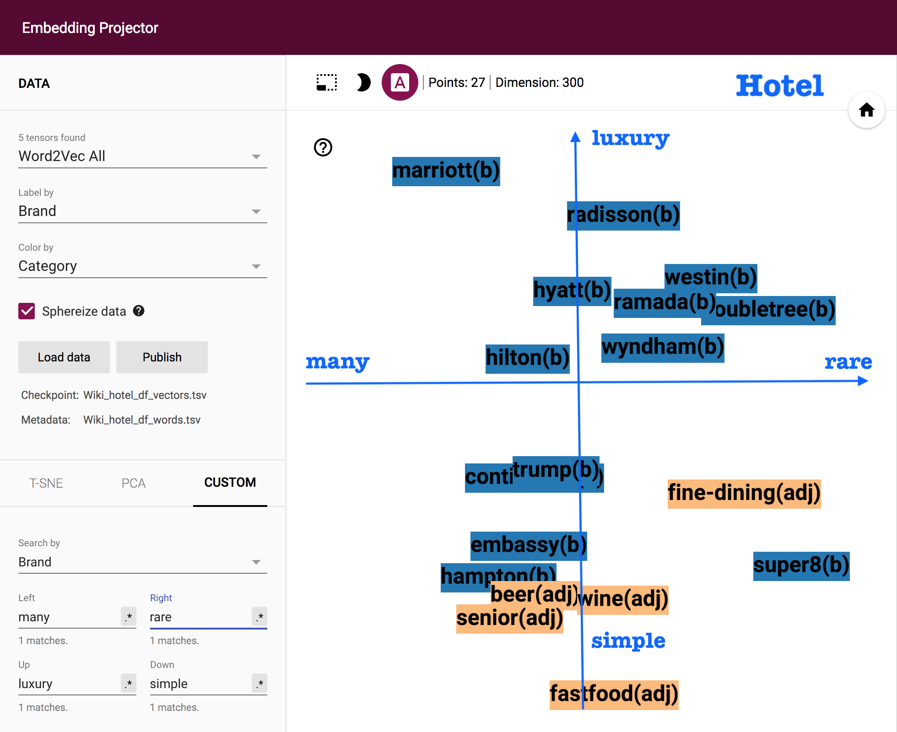
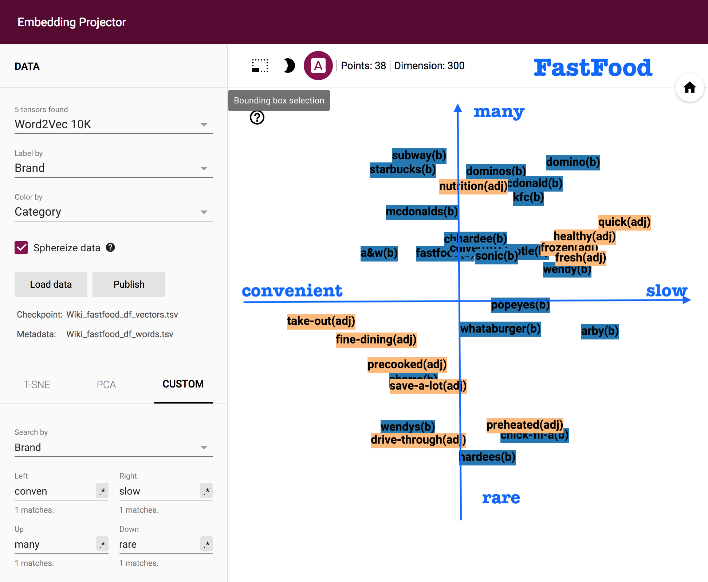

# Memory-Brand-Recall

Researching code for investigating the relationship between human language and brain memory at NeuroEcon Lab at UC Berkeley. (Proceeding for NAACL2019).

Word embeddings models such as word2vec and GloVe are now widely used as representations of word meaning. Typically, these models show high consistency with Human normative judgments (e.g. similarity, relatedness, or analogy datasets). In this study, we investigate using word embeddings for a different facet of human language and memory relying on word meaning, which is memory accessibility when prompted with a cue. We quantified accessibility using human behavioral data from the semantic fluency task, where participants are asked to generate as many examples as they can that belong to a certain category (e.g. fruit). This is a popular task commonly used to assess semantic memory and detect important neurological diseases such as Alzheimer’s disease (AD), which has been reported to predict cognitive impairments in and progression of AD. Specifically, we examine if words with higher similarity to the cue have higher probability of being successfully recalled in the task. To test this hypothesis, we collected semantic fluency data for a variety of consumer product category cues, and compared the empirical recall probabilities against predictions generated by a variety of word embeddings models. We find a consistently high degree of accuracy in tracking empirical retrieval probability across different cues, indicating the validity and value of word embeddings models in predicting behavioral output of semantic retrieval processes based on word meanings. We also explore the effect on prediction accuracy by the text corpora used to train the word embeddings as well as demographic attributes of the participants.
    
Our research word vectors are from GloVe (Twitter, Wikipedia) and Word2vec. Customer memory data were collected online.
    
To see the full details including :

- [x] Categorical analysis for each category (30 categories in total, e.g. fastfood, luxury_car)
- [x] PCA/t-SNE dimension reduction
- [x] Logistic regression modeling 
- [x] Tensorboard demonstrating 

Please check the jupyter notebooks.
    
    Several interesting results through tensorboard projector:
    
    The first one is how hotel brands (such as Marriott, Hilton, Hampton) align with adjective word `luxury vs simaple` and `many vs rare`. CLearly, high-end hotel such Mattiott and closer to word dimension "luxury", while convenient hotel "super8" is closer to simple.
    

    

    Similar results for fastfood brands.
    

    

    
